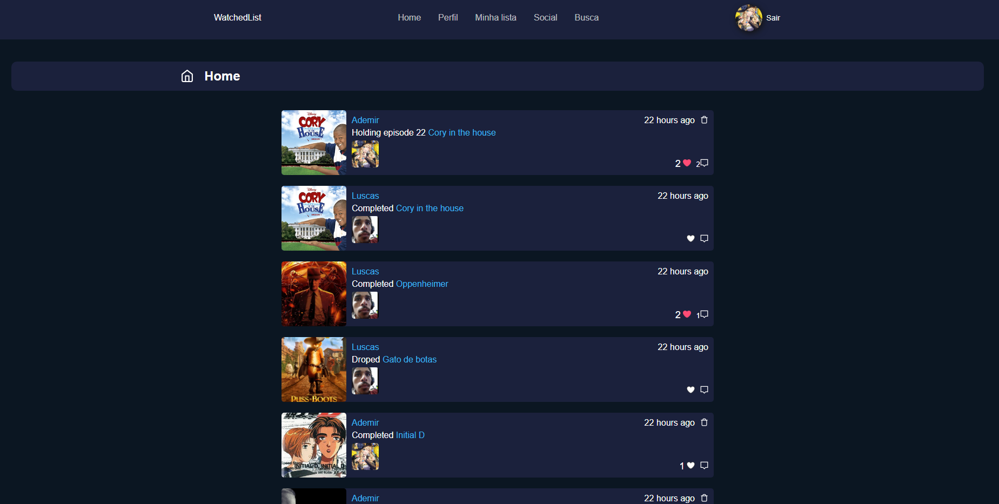
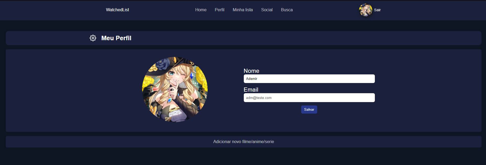
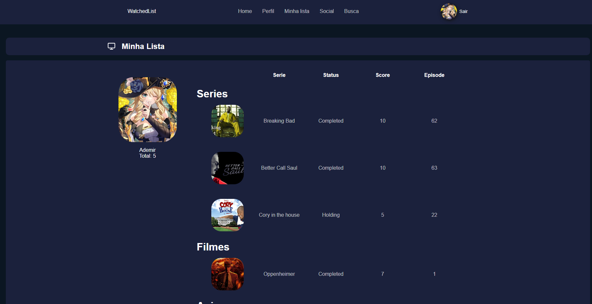
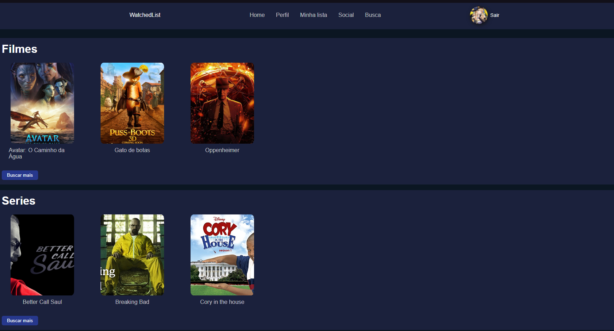

# Watched List App

# Sobre

O WatchedListApp é um app onde o usuário adiciona filmes, series e animes ao seu perfil com o intuito interragir com outros usuários e armazenar suas series favoritas em seu perfil de usuário.

## Rodando Aplicação

Instalando depêndencias
```bash
  npm install
```

Executando o app:
```bash
  npm start
```

# Algumas telas do projeto

# Home


# Perfil


# Lista


# Series
