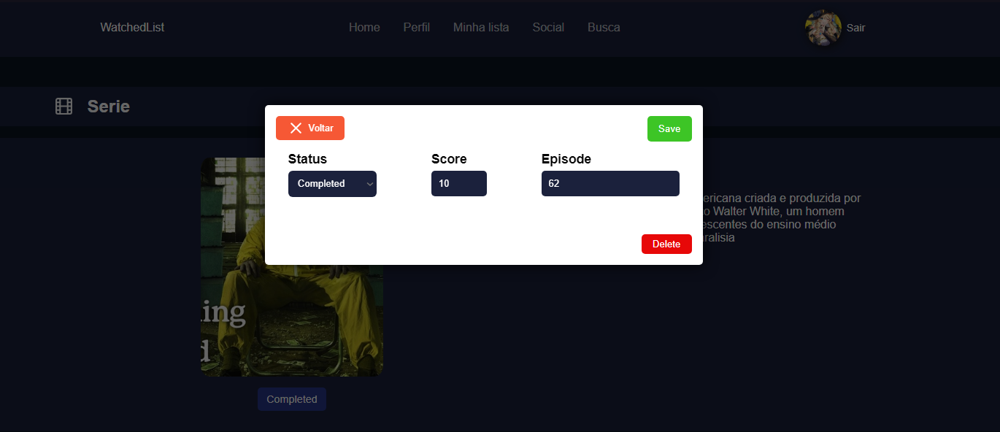

# Watched List App

# Sobre

O WatchedListApp é um app onde o usuário adiciona filmes, series e animes ao seu perfil com o intuito interragir com outros usuários e armazenar suas series favoritas em seu perfil de usuário.

## Rodando Aplicação

Executando o app:
```bash
  # Iniciar Container
  docker-compose up -d

  # Esperar inicialização do BD e executar:
  docker-compose exec backend sequelize db:migrate
```

# Algumas telas do projeto

## Home


## Perfil


## Lista


## Series


## Serie


